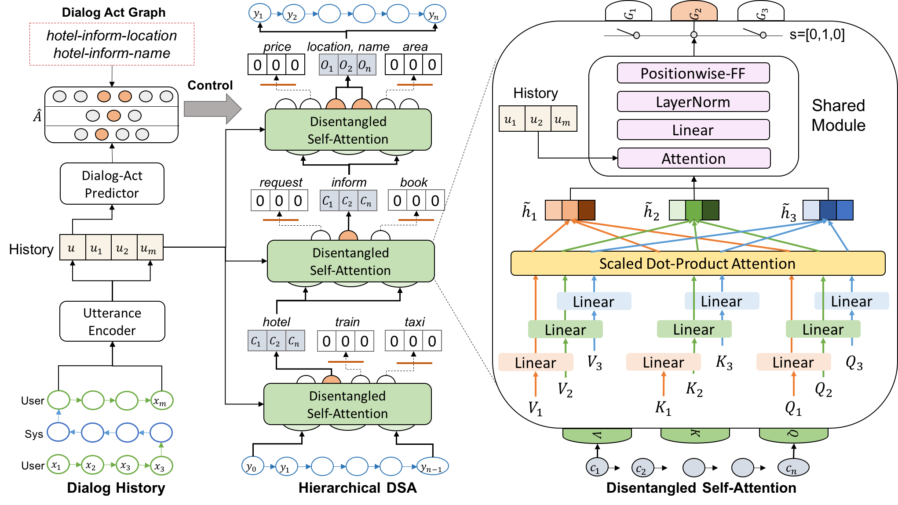

# HDSA-Dialog
This is the code and data for ACL 2019 long paper "Semantically Conditioned Dialog Response Generation via Hierarchical Disentangled Self-Attention". The up-to-date version is in [http://arxiv.org/abs/1905.12866](http://arxiv.org/abs/1905.12866).

The full architecture is displayed as below:

The architecture consists of two components:
- Dialog act predictor (Fine-tuned BERT model)
- Response generator (Hierarchical Disentangled Self-Attention Network)

The basic idea of the paper is to do enable controlled reponse generation under the Transformer framework, where we construct a dialog act graph to represent the semantic space in MultiWOZ tasks. Then we particularly specify different heads in different levels to a specific node in the dialog act graph. For example, the picture above demonstrates the merge of two dialog acts "hotel->inform->location" and "hotel->inform->name". The generated sentence is controlled to deliever message about the name and location of a recommended hotel. 
